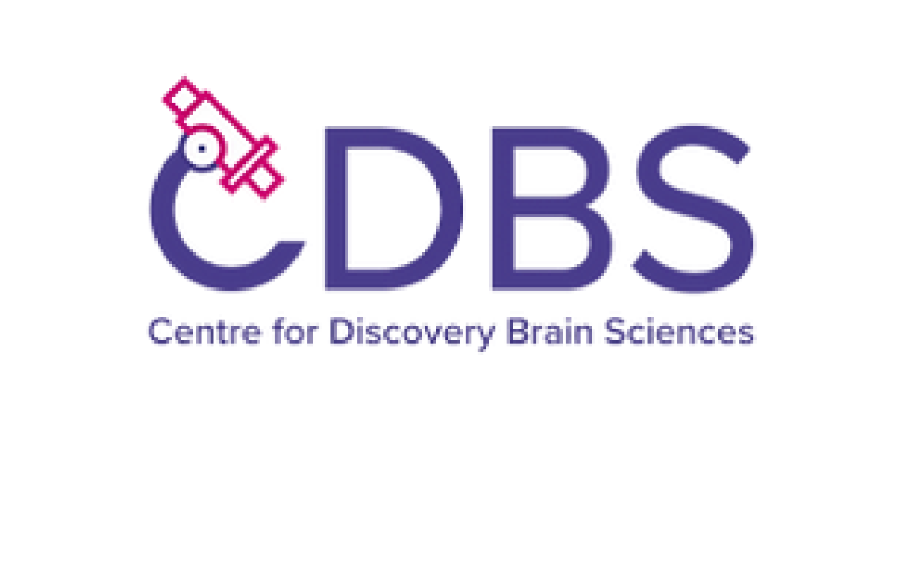

---
---

Our interactions with the world are highly flexible. For example, our response to the sound of our phone ringing is very different if we are at the theater watching a play, or if we are anxiously waiting for an important call. More generally, our thoughts and actions depend heavily on the current context, which includes our goals, past experience, and future expectations. How does our brain integrate such contextual information with the constant stream of sensory stimuli to flexibly guide our decisions?

In our laboratory, we address this question using a combination of computational, behavioral, electrophysiological, and optogenetic techniques. By investigating the neural mechanisms underlying cognitive flexibility and decision-making, we aim to understand how these fundamental cognitive processes are disrupted in neuropsychiatric and neurodevelopmental disorders.

Our goal is to address three fundamental questions:





### What neural mechanisms underlie our ability to flexibly form decisions?

To study the neural basis of flexible decision-making, we train rats to solve sophisticated tasks with rapidly changing rules. To solve these tasks, rats learn to use contextual information to flexibly form decisions about sensory stimuli. We then study neural responses during this behavior, and we build computational models to understand the underlying mechanisms.







### How do neural computations underlying cognitive behavior vary across individuals?

[Our recent work](https://doi.org/gsx659) indicates that individual rats can use different neural mechanisms to perform an identical cognitive task. These findings highlight the importance of measuring and characterizing neural circuits at the level of individual animals. To achieve this goal, we leverage a system for automated, high-throughput behavioral training, integrated with wireless electrophysiology and optogenetics. These techniques allow us to study the learning trajectory of each individual animal, and to explore the neural substrates of individual variability.







### How do genetic mutations impact neural circuits underlying flexible decision-making?

Deficits in cognitive flexibility and decision-making are a profoundly debilitating feature of many neurodevelopmental disorders. Despite significant recent progress in identifying the genetic causes of these disorders, the mechanisms linking genetic mutations to cognitive deficits are still largely unknown. To address this problem, we study how flexible decision-making is altered in rat models of neurodevelopmental disorders. Using electrophysiology, optogenetics and computational analyses, we study how cellular and circuit alterations induced by genetic mutations affect cognitive computations at the system level. 







#### Funding and Support

Our laboratory is part of the [Simons Initiative for the Developing Brain (SIDB)](https://sidb.org.uk/) and the [Centre for Discovery Brain Sciences (CDBS)](https://discovery-brain-sciences.ed.ac.uk/) at the University of Edinburgh. We fully embrace the spirit of collaboration of SIDB and CDBS and we collaborate with many researchers within the Institutes and the University.

We are currently supported by generous funding by the [Simons Foundation Autism Research Initiative (SFARI)](https://www.sfari.org/) and SIDB.















